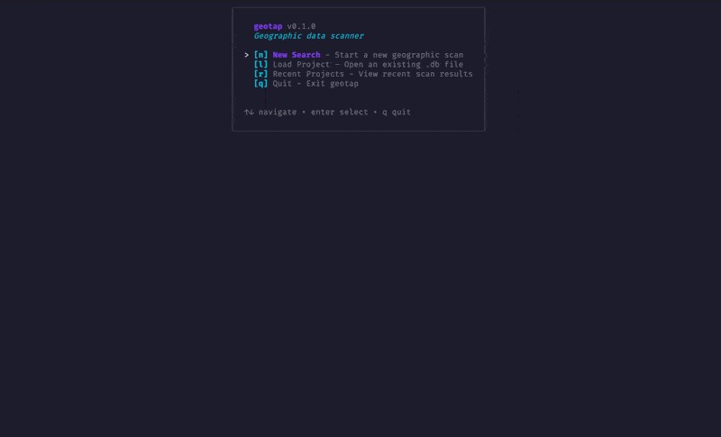

<div align="center">
  

<picture>
    <source media="(prefers-color-scheme: dark)" srcset="assets/banner-dark.svg">
    
  </picture>

<p align="center">
  <a href="https://go.dev"></a>
  <a href="https://pkg.go.dev/github.com/rendis/map_scrapper"></a>
  <a href="LICENSE"></a>
  <a href="https://goreportcard.com/report/github.com/rendis/map_scrapper"></a>
  <a href="https://github.com/rendis/geotap/releases"></a>
  <a href="https://github.com/rendis/geotap/commits/main"></a>
  <a href="https://github.com/rendis/geotap"></a>
  <a href="https://github.com/rendis/geotap/graphs/contributors"></a>
  <a href="#ai-agent-skill"></a>
  <a href="https://deepwiki.com/rendis/geotap"></a>
</p>

</div>

Google Maps scraper that requires no API key or login. Extracts business listings by country, region, or coordinates with TLS fingerprinting and anti-blocking measures. CLI and interactive TUI modes. Exports to SQLite and CSV.

<p align="center">
  
</p>

## Table of Contents

- [Key Features](#key-features)
- [Installation](#installation)
- [Quick Start](#quick-start)
  - [TUI Mode](#tui-mode)
  - [CLI Scan](#cli-scan)
  - [Export](#export)
- [CLI Reference](#cli-reference)
- [Data Fields](#data-fields)
- [Anti-Blocking](#anti-blocking)
- [Architecture](#architecture)
- [AI Agent Skill](#ai-agent-skill)
  - [Install via skills.sh](#install-via-skillssh)
  - [Install via symlink (Claude Code)](#install-via-symlink-claude-code)
- [Tech Stack](#tech-stack)
- [Acknowledgments](#acknowledgments)
- [License](#license)

## Key Features

| Feature                  | Description                                                                         |
| ------------------------ | ----------------------------------------------------------------------------------- |
| **No API Key**           | Scrapes Google Maps directly, no credentials or billing required                    |
| **Anti-Blocking**        | TLS fingerprinting (utls), Chrome UA rotation, exponential backoff, cookie consent  |
| **Country Mode**         | Scan entire countries with automatic grid generation and ocean filtering            |
| **Coordinate Mode**      | Search within a radius around any lat/lng point                                     |
| **Interactive TUI**      | Full terminal UI with search form, live progress, result explorer                   |
| **Country Autocomplete** | Searchable country selector with 177 countries (English + Spanish names, ISO codes) |
| **Live Filtering**       | Accent-insensitive, multi-word fuzzy search across all business fields              |
| **Geo Filtering**        | Business coordinates validated against country polygon boundaries                   |
| **SQLite Storage**       | Deduplicated results with `UNIQUE(cid, query)` constraint                           |
| **CSV Export**           | Export filtered or full results to CSV from TUI or CLI                              |
| **Proxy Support**        | HTTP and SOCKS5 proxy for IP rotation                                               |
| **Cross-Platform**       | macOS (Apple Silicon + Intel), Linux (amd64/arm64), Windows                         |
| **Agent Skill**          | Built-in[AI coding agent](https://agentskills.io) guidance                          |

## Installation

### One-line install (macOS / Linux)

```bash
curl -fsSL https://raw.githubusercontent.com/rendis/geotap/main/install.sh | bash
```

### Go install

```bash
go install github.com/rendis/map_scrapper/cmd/geotap@latest
```

### Build from source

```bash
git clone https://github.com/rendis/geotap.git
cd geotap
make build
```

> **Requirements:** Go 1.24+

## Quick Start

### TUI Mode

Launch the interactive terminal UI:

```bash
geotap
```

Navigate with arrow keys, `tab` between fields, `enter` to confirm. The search form includes a live country autocomplete that matches by name, Spanish name, and ISO codes.

### CLI Scan

Scan an entire country:

```bash
geotap scan -queries "restaurants,cafes" -country Chile -output ./projects
```

Scan a specific region:

```bash
geotap scan -queries "hotels" -country Spain -region "Catalonia" -output ./projects
```

Scan around coordinates:

```bash
geotap scan -queries "pharmacies" -lat 40.4168 -lng -3.7038 -radius 5 -output ./projects
```

Full options:

```bash
geotap scan \
  -queries "restaurants,bars" \
  -country Germany \
  -zoom 12 \
  -concurrency 50 \
  -min-rating 4.0 \
  -lang de \
  -output ./data
```

### Export

```bash
geotap export -db ./projects/geotap_20260212_120000.db
```

## CLI Reference

| Flag            | Default    | Description                                                                   |
| --------------- | ---------- | ----------------------------------------------------------------------------- |
| `-queries`      | _required_ | Comma-separated search terms                                                  |
| `-output`       | _required_ | Output directory for `.db` and `.log` files                                   |
| `-country`      |            | Country name or ISO code (2/3 letter)                                         |
| `-region`       |            | Region or state within country                                                |
| `-lat` / `-lng` |            | Center coordinates (alternative to `-country`)                                |
| `-radius`       | `10`       | Search radius in km (coordinate mode)                                         |
| `-zoom`         | auto       | Grid level 10-16. Lower = faster/fewer results, higher = slower/more coverage |
| `-concurrency`  | `10`       | Max parallel requests                                                         |
| `-max-pages`    | `1`        | Pagination depth per sector                                                   |
| `-min-rating`   | `0`        | Minimum star rating filter                                                    |
| `-max-rating`   | `0`        | Maximum star rating filter                                                    |
| `-lang`         | `en`       | Search language code                                                          |
| `-proxy`        |            | HTTP or SOCKS5 proxy URL                                                      |
| `-debug`        | `false`    | Dump raw Google responses                                                     |

Each scan generates timestamped files: `geotap_YYYYMMDD_HHMMSS.db` (SQLite) and `.log` (session log).

## Data Fields

Each business record contains 21 fields:

| Field          | Type   | Description             |
| -------------- | ------ | ----------------------- |
| `name`         | string | Business name           |
| `rating`       | float  | Star rating (0-5)       |
| `review_count` | int    | Number of reviews       |
| `category`     | string | Primary category        |
| `categories`   | string | All categories          |
| `address`      | string | Street address          |
| `city`         | string | City                    |
| `postal_code`  | string | Postal/ZIP code         |
| `country_code` | string | ISO country code        |
| `lat` / `lng`  | float  | Coordinates             |
| `phone`        | string | Phone number            |
| `website`      | string | Website URL             |
| `google_url`   | string | Google Maps profile URL |
| `description`  | string | Business description    |
| `price_range`  | string | Price indicator         |
| `cid`          | string | Google business CID     |
| `place_id`     | string | Google Places ID        |
| `open_hours`   | string | Operating hours         |
| `thumbnail`    | string | Thumbnail image URL     |
| `query`        | string | Search query used       |

## Anti-Blocking

### Why it works on a single IP

Google's bot detection targets repetitive patterns: same endpoint, same parameters, rapid-fire from one source. GeoTap avoids this by design — each request targets **unique geographic coordinates** across a grid, so the traffic looks like a user browsing different map areas. Combined with TLS fingerprinting that mimics a real Chrome browser, Google sees normal browsing, not scraping.

### Techniques

- **TLS Fingerprinting** — `refraction-networking/utls` with Chrome Auto preset and HTTP/1.1 ALPN. Standard Go TLS gets fingerprinted and blocked.
- **Unique Coordinates per Request** — Grid-based scanning ensures every request hits different lat/lng. No repeated endpoints.
- **Ocean Filtering** — Country polygon boundaries discard grid sectors that fall over oceans or outside borders, avoiding unnecessary requests.
- **User Agent Rotation** — Chrome UAs across Windows, macOS, and Linux, rotated randomly per request.
- **Cookie Consent** — Pre-sets `CONSENT=YES+` cookie to bypass the consent interstitial.
- **Adaptive Throttling** — On rate limits (429/403/302): +500ms delay per consecutive hit (max 5s), -100ms on success. Aborts after 50 consecutive blocks.
- **Exponential Backoff** — Per-request retries: 2s base, 30s max, 50% jitter, 3 attempts.
- **Connection Pooling** — 150 max idle connections per host with 90s timeout and keep-alive.
- **Proxy Support** — Optional HTTP/SOCKS5 proxy via `-proxy` flag for IP rotation.

## Architecture

```
cmd/geotap/
  main.go             Entry point: TUI (default) or CLI subcommand
  scan.go             Headless scan: flags → grid → scraper → SQLite
  export.go           SQLite → CSV export

internal/
  model/              Business (21 fields), SearchParams, Sector
  engine/
    geo/              Grid generation, 177-country boundaries, geocoding
    scraper/          utls HTTP client, worker pool, Google Maps parser
    storage/          SQLite with dedup (UNIQUE cid+query)
  tui/
    views/            home, search, progress, explorer, recent, filepicker
    styles/           Color theme (violet/cyan palette)
    components/       Reusable UI components
```

## AI Agent Skill

GeoTap includes an [Agent Skill](https://agentskills.io/specification) that provides AI coding agents (Claude Code, Cursor, etc.) with structured guidance for using this tool.

### Install via [skills.sh](https://skills.sh)

```bash
npx skills add https://github.com/rendis/geotap --skill geotap
```

### Install via symlink (Claude Code)

```bash
ln -s /path/to/geotap/skills/geotap ~/.claude/skills/geotap
```

## Tech Stack

| Component          | Technology                                                                                                      |
| ------------------ | --------------------------------------------------------------------------------------------------------------- |
| Language           | Go 1.24                                                                                                         |
| TUI Framework      | [Bubbletea](https://github.com/charmbracelet/bubbletea) + [Lipgloss](https://github.com/charmbracelet/lipgloss) |
| TLS Fingerprinting | [utls](https://github.com/refraction-networking/utls)                                                           |
| Database           | [modernc.org/sqlite](https://pkg.go.dev/modernc.org/sqlite) (pure Go)                                           |
| Geospatial         | [paulmach/orb](https://github.com/paulmach/orb)                                                                 |
| Text Normalization | [golang.org/x/text](https://pkg.go.dev/golang.org/x/text)                                                       |
| Boundaries         | [Natural Earth](https://www.naturalearthdata.com/) ne_110m (embedded)                                           |
| Release            | [GoReleaser](https://goreleaser.com/) + GitHub Actions                                                          |

## Acknowledgments

The core ideas behind GeoTap's anti-blocking strategy were inspired by [this thread](https://x.com/edu_seo_scraper/status/2021941246609305686) from [@edu_seo_scraper](https://x.com/edu_seo_scraper). Thanks for sharing the insights.

## License

[MIT](LICENSE) — Copyright (c) 2025 rendis

---

<div align="center">
  <sub>Built for data that lives on the map.</sub>
</div>
